# Star Tracker Report

**2026-08-31** | Total: **919 stars** | Change: **0**

> Compared to snapshot from 2026-08-30

## 📈 Star Trend

### By Repository

Individual Repository Charts

#### saucer/saucer

## Repositories

| Repositories | Stars | Change | Trend |
|:-----------|------:|-------:|:-----:|
| [saucer/saucer](https://github.com/saucer/saucer) | 919 | 0 | ➖ |

## 🔮 Growth Forecast

**Aggregate Forecast**

| Method | Week 1 | Week 2 | Week 3 | Week 4 |
|:---|---:|---:|---:|---:|
| Linear Regression | 923 | 927 | 931 | 935 |
| Weighted Moving Average | 924 | 930 | 935 | 940 |

### By Repository

saucer/saucer

**saucer/saucer**

| Method | Week 1 | Week 2 | Week 3 | Week 4 |
|:---|---:|---:|---:|---:|
| Linear Regression | 923 | 927 | 931 | 935 |
| Weighted Moving Average | 924 | 930 | 935 | 940 |

---
*Generated by [GitHub Star Tracker](https://github.com/fbuireu/github-star-tracker) on 2026-08-31T01:44:37.301Z*

*Made with 🤘 by [Ferran Buireu](https://github.com/fbuireu)*

