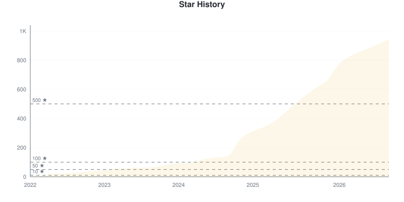
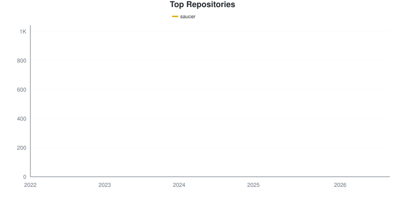
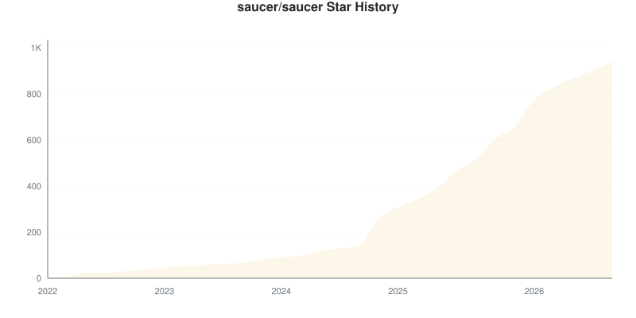
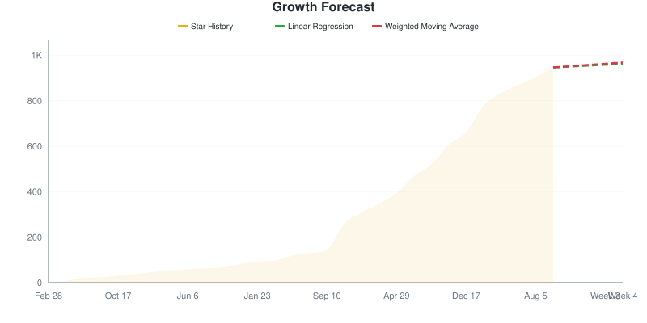

# Star Tracker Report

**2026-10-04** | Total: **945 stars** | Change: **-1**

> Compared to snapshot from 2026-10-03

## 📈 Star Trend

### By Repository

Individual Repository Charts

#### saucer/saucer

## Repositories

| Repositories | Stars | Change | Trend |
|:-----------|------:|-------:|:-----:|
| [saucer/saucer](https://github.com/saucer/saucer) | 945 | -1 | ⬇️ |

## Summary

- **Stars gained:** 0
- **Stars lost:** 1
- **Net change:** -1

## 🔮 Growth Forecast

**Aggregate Forecast**

| Method | Week 1 | Week 2 | Week 3 | Week 4 |
|:---|---:|---:|---:|---:|
| Linear Regression | 949 | 953 | 957 | 961 |
| Weighted Moving Average | 950 | 956 | 961 | 967 |

### By Repository

saucer/saucer

**saucer/saucer**

| Method | Week 1 | Week 2 | Week 3 | Week 4 |
|:---|---:|---:|---:|---:|
| Linear Regression | 949 | 953 | 957 | 961 |
| Weighted Moving Average | 950 | 956 | 961 | 967 |

---
*Generated by [GitHub Star Tracker](https://github.com/fbuireu/github-star-tracker) on 2026-10-04T02:55:41.001Z*

*Made with 🤘 by [Ferran Buireu](https://github.com/fbuireu)*

