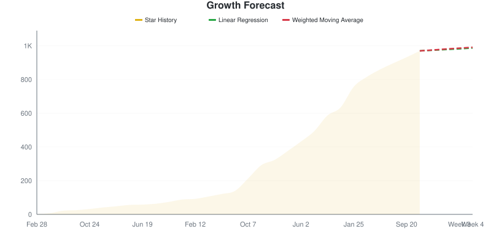

# Star Tracker Report

**2026-11-18** | Total: **970 stars** | Change: **+2**

> Compared to snapshot from 2026-11-17

## 📈 Star Trend

### By Repository

Individual Repository Charts

#### saucer/saucer

## Repositories

| Repositories | Stars | Change | Trend |
|:-----------|------:|-------:|:-----:|
| [saucer/saucer](https://github.com/saucer/saucer) | 970 | +2 | ⬆️ |

## Summary

- **Stars gained:** 2
- **Stars lost:** 0
- **Net change:** +2

## 🔮 Growth Forecast

**Aggregate Forecast**

| Method | Week 1 | Week 2 | Week 3 | Week 4 |
|:---|---:|---:|---:|---:|
| Linear Regression | 974 | 978 | 982 | 987 |
| Weighted Moving Average | 975 | 981 | 986 | 991 |

### By Repository

saucer/saucer

**saucer/saucer**

| Method | Week 1 | Week 2 | Week 3 | Week 4 |
|:---|---:|---:|---:|---:|
| Linear Regression | 974 | 978 | 982 | 987 |
| Weighted Moving Average | 975 | 981 | 986 | 991 |

---
*Generated by [GitHub Star Tracker](https://github.com/fbuireu/github-star-tracker) on 2026-11-18T04:46:44.266Z*

*Made with 🤘 by [Ferran Buireu](https://github.com/fbuireu)*

